<a href="https://gurukiran10.github.io"></a>

  &nbsp;
  &nbsp;
  &nbsp;
  

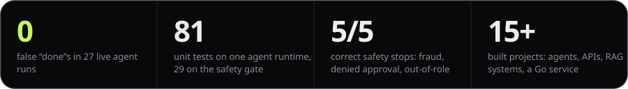

  

<a href="https://github.com/Gurukiran10/ai-workforce">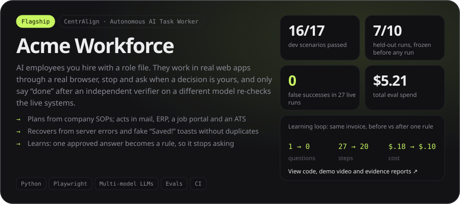</a>

  <a href="https://youtu.be/hfl3IZnOA8M">▶ Demo video</a> ·
  <a href="https://gurukiran10.github.io/ai-workforce/">Showcase</a> ·
  <a href="https://gurukiran10.github.io/ai-workforce/runs/sample-invoice-over-limit-approval/report.html">Evidence report</a>

  <a href="https://github.com/Gurukiran10/research-agent">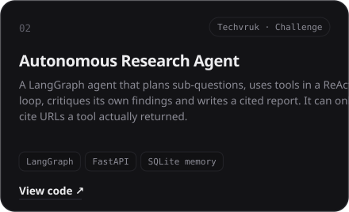</a>
  <a href="https://github.com/Gurukiran10/atlas-financial-assistant">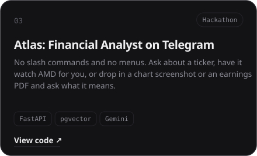</a>

  <a href="https://aivoa-complaint-system-xi.vercel.app">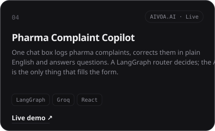</a>
  <a href="https://github.com/Gurukiran10/convin-backend">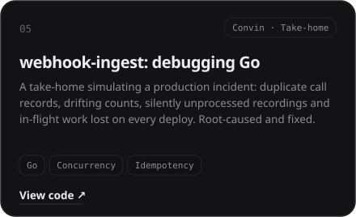</a>

  <a href="https://meeting-intelligence-five.vercel.app">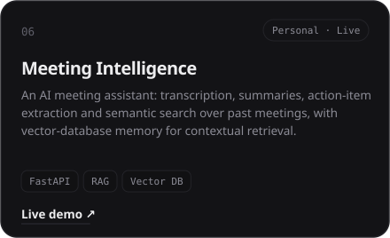</a>
  <a href="https://github.com/Gurukiran10/lead-enrichment-agent">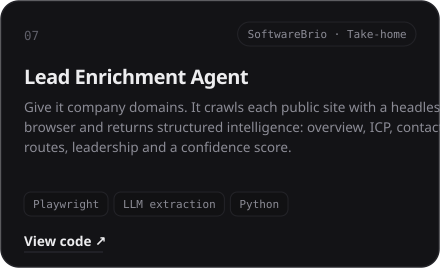</a>

 

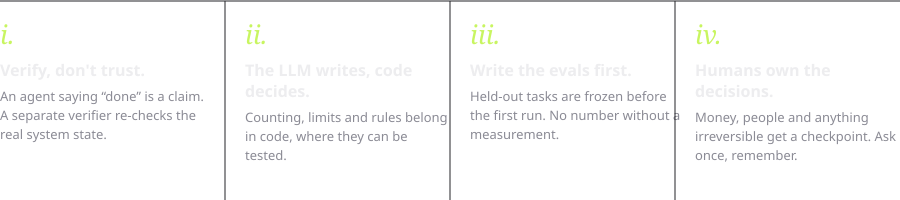

  

  

<a href="mailto:sgurukiran1@gmail.com">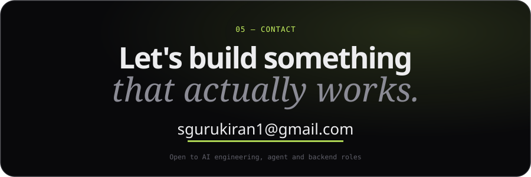</a>

B.E. AI &amp; ML, BITM Ballari (2026) · ex-AI Platform Developer Intern, SeedlingLabs · 🏍️ off the keyboard: riding bikes

